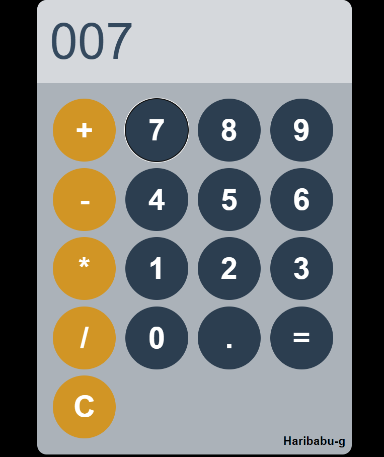

# Simple Basic Calculator 🧮

This project is a simple web application for performing basic arithmetic operations like addition, subtraction, multiplication, and division using HTML, CSS, and JavaScript.

## Table of Contents 📝

- [Description](#description-ℹ️)
- [Technologies Used](#technologies-used-💻)
- [Features](#features-✨)
- [Installation](#installation-🚀)
- [Usage](#usage-💻)
- [Preview](#preview-📸)
- [Contributing](#contributing-🤝)


## Description ℹ️

Simple Basic Calculator is a web-based calculator that allows users to perform basic arithmetic operations. It uses HTML for the structure, CSS for styling, and JavaScript for the functionality. This project is a great way to understand the integration of these technologies in a practical application.

## Technologies Used 💻

- HTML5
- CSS3
- JavaScript

## Features ✨

- Basic arithmetic operations: addition, subtraction, multiplication, and division
- Responsive design for various device sizes
- User-friendly interface

## Installation 🚀

To install Simple Basic Calculator, simply clone this repository to your local machine:

```bash
git clone https://github.com/your-username/simple-basic-calculator.git
```

## Usage 💻

1. Navigate to the project directory:

    ```bash
    cd simple-basic-calculator
    ```

2. Open the `index.html` file in your preferred web browser.

3. Use the calculator by clicking the buttons to perform calculations.

4. Customize the calculator content by editing the HTML file and modifying the CSS styles in the `styles.css` file.

## Preview 📸



## Contributing 🤝

Contributions are welcome! If you have any ideas for improving Simple Basic Calculator or encounter any issues, feel free to open an issue or submit a pull request. Please follow the [Contributing Guidelines](CONTRIBUTING.md) when contributing to this project.

Happy calculating! 🎉


