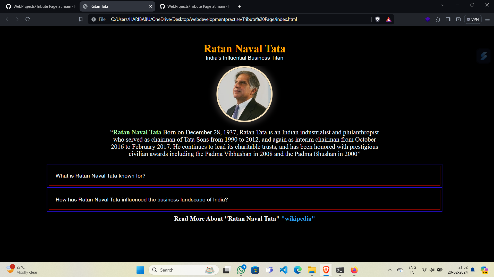

# Tribute Page Project

This is a simple tribute page project created as part of my Web Development Journey to pay homage to a notable figure in the history of India's influential business titan.

## Table of Contents

- [Introduction](#introduction)
- [Technologies Used](#technologies-used)
- [Features](#features)
- [Usage](#usage)
- [Contributing](#contributing)

## Introduction

This project is a tribute page dedicated to [Ratan Naval Tata]. It provides a brief overview of his life, achievements, and contributions.

## Technologies Used

- HTML5
- CSS3

## Features

- Responsive design: The page is designed to be accessible and visually appealing on different devices and screen sizes.
- Interactive elements: Links and other interactive elements enhance the user experience.
- Media integration: Incorporation of images and other media enriches the content.

## Usage

To view the tribute page:

1. Clone this repository to your local machine.
2. Open the `index.html` file in your preferred web browser.

Feel free to explore the content and navigate through the page to learn more about [Ratan Naval Tata].

## Preview

## Contributing

Contributions to enhance the tribute page are welcome! If you have any suggestions, improvements, or bug fixes, please feel free to open an issue or submit a pull request.
